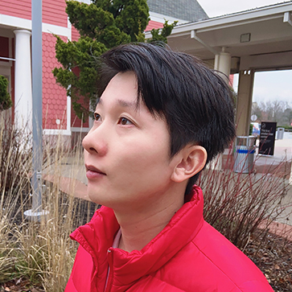

<h1 align="center" style="border: none">

</h1>

<h2 align="center" style="border: none">🤗 Hello, my name is Youwei Huang</h2>

🌟 Welcome to my little corner of GitHub! I'm Youwei Huang, your friendly neighborhood research engineer and team manager over at the Institute of Intelligent Computing Technology in Suzhou, CAS. My playground? Oh, just some light tinkering with <b>Large Language Models (LLM)</b>, <b>Blockchain</b>, and <b>Software Engineering</b>.
  
🛠️ When I’m not busy pretending to be a mad scientist, I’m leading super-awesome projects that blend academic research with real-world applications. A few patents here, a few papers there – you know, just casually shaping the future.
  
🔬 I’m one of a kind – dabbling in research, engineering, and business. Whether it's diving deep into the mysteries of blockchain, exploring the uncharted territories of web3, or riding the waves of generative AI and deep learning – I’m here to push the envelope.
  
💼 Currently, I’ve got my hands full leading some pretty open-source projects like [UniAI](https://github.com/orgs/uniai-lab/repositories), [LeChat](https://lechat.cas-ll.cn), and [SmartIntentNN](https://github.com/web3se-lab/web3-sekit). These bad boys touch on LLM, deep learning, software engineering, web development, and blockchain.
  
🚀 My mission? To sprinkle some scientific research magic into our daily grind and hopefully make a dent in the industrial universe. Who knows, maybe one day we’ll even disrupt some markets together. Dream big, right?
  
🤝 If you’re as psyched about these fields as I am or if you’ve got some killer ideas floating around, why not join the fun? I’m always open to collaborations. Let's make some cool stuff together!
  

Cheers, Youwei Huang

